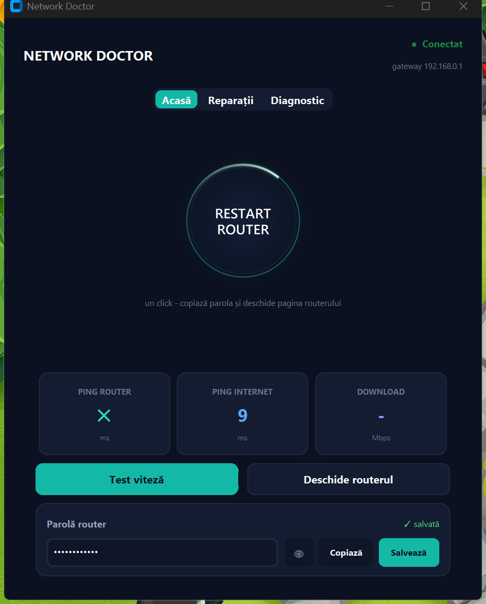

# Network Doctor

A desktop app for diagnosing and fixing internet problems without digging through cmd or terminal.

Runs on **Windows**, **Linux**, and **macOS**.



## What it does

- Checks your connection status on launch
- Pings your router, Google DNS, Cloudflare, and google.com
- Shows your IP, gateway, and DNS config
- One-click fixes: flush DNS, renew IP, restart adapter, reset network stack
- Sets fast DNS (Cloudflare 1.1.1.1 + Google 8.8.8.8) with admin elevation
- Saves your router admin password locally (base64-encoded, stored in `~/.network-doctor.json`)
- Auto-detects your router IP from the default gateway — no hardcoded addresses

## Requirements

- Python 3.10+
- `customtkinter` — install with `pip install customtkinter`

## Running it

**Windows** — double-click `network-doctor.bat` (runs as admin automatically) or `network-doctor.vbs` (silent, no console window)

**Linux / macOS:**
```bash
pip3 install customtkinter
chmod +x run.sh
./run.sh
```

Or directly:
```bash
python3 network-doctor.py
```

## Quick fixes by platform

| Fix | Windows | macOS | Linux |
|-----|---------|-------|-------|
| Flush DNS | `ipconfig /flushdns` | `dscacheutil -flushcache` | `resolvectl flush-caches` |
| Renew IP | `ipconfig /release /renew` | `ipconfig set <iface> DHCP` | `dhclient` |
| Reset network | `netsh winsock reset` | restart mDNSResponder | restart NetworkManager |
| Restart adapter | PowerShell `Restart-NetAdapter` | `ifconfig down/up` | `ip link down/up` |

Fixes that need admin (DNS setting, adapter power management) trigger a UAC prompt on Windows, `osascript` on macOS, or `pkexec`/terminal sudo on Linux.

## Password storage

The router password is saved in `~/.network-doctor.json` encoded as base64. It's not encrypted — this is a local convenience tool, not a password manager. Don't use it to store sensitive credentials.

## License

MIT
